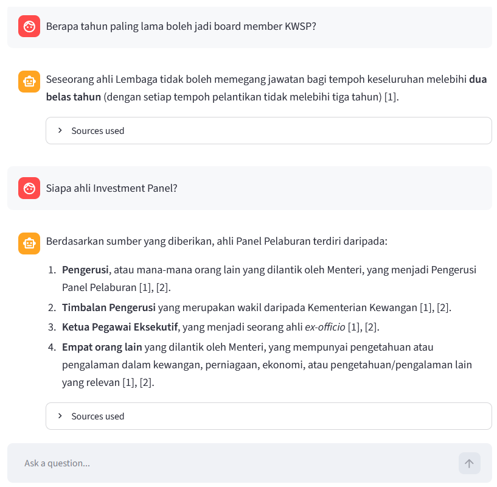
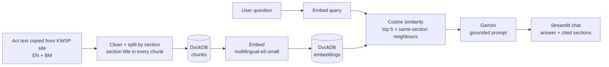

# KWSP / EPF Act Assistant

A bilingual (English / Bahasa Melayu) question-answering chatbot over Malaysia's Employees Provident Fund Act 1991. Built as a data engineering portfolio project: the focus is the pipeline, data quality and evaluation behind the chatbot, not just the chat window.

**Live demo:** <PASTE YOUR STREAMLIT URL>
The app sleeps when idle, so the first load can take a minute.



## What it does

- Answers questions in English, BM or Manglish using only text retrieved from the Act
- Cites the section each answer came from (for example "Section 22") and shows the source text
- Says it could not find an answer when the documents don't contain one. Dividend rates are one example: they are not loaded, and the bot declines.

## How it works



| File | Role |
|---|---|
| `scripts/03_chunk_sections.py` | Cleans the text, splits it at section headings, puts the section number and title at the start of every chunk, loads chunks into DuckDB |
| `scripts/04_embed.py` | Embeds each chunk with `multilingual-e5-small` and stores 384-dimension vectors in DuckDB |
| `scripts/10_evaluate.py` | Runs the question set and reports the hit rate by language |
| `scripts/11_diagnose_misses.py` | For every miss, shows where the right chunk ranked and what came back instead |
| `eval/questions.csv` | 36 evaluation questions |
| `app.py` | Streamlit chat app |
| `scripts/archive/` | Earlier exploratory scripts (PDF extraction, terminal search). Not part of the current pipeline |

Current corpus: the English and BM versions of the EPF Act 1991 (text copied from the KWSP website), 496 chunks in total.

## Evaluation

36 hand-written questions: 12 topics from different parts of the Act, each asked in English, BM and Manglish. Each question has a short phrase copied from the Act's answer passage. A question counts as a **hit** if that phrase appears in the retrieved text (the top-ranked chunks plus neighbouring chunks of the same section). This measures retrieval only, not whether Gemini's final answer is correct.

| Step | Retrieval setting | Hits (retrieved chunks only) |
|---|---|---|
| Baseline: 800-character chunks | top 3 | 25 of 36 |
| Removed website menus, footers and amendment table | top 3 | 23 of 36 |
| Left out Part IX (repeal and transitional provisions) | top 3 | 26 of 36 |
| Split by section, section title in every chunk | top 3 | 29 of 36 |
| Retrieve 5 chunks | top 5 | 32 of 36 |
| Add neighbouring chunks from the same section (±2) | top 5 | **33 of 36** |

Final result by language (top 5, neighbours ±2): English 11 of 12, BM 12 of 12, Manglish 10 of 12. Manglish questions accept a match in either language, so that row is more lenient.

Misses at the final setting:
- *Who is not allowed to serve on the Board?* The Act says "disqualified". The embedding model does not connect the two wordings.
- *Boleh complain berapa lama lepas withdraw kalau jumlah salah?* "Salah" (wrong) is matched to "kesalahan" (offence).
- *Berapa orang minimum untuk Investment Panel meeting?* The right section ranked just outside the top 5.

**Read the 33 of 36 with care.** The question set is small, so one question moves the score by about three points. The settings and several cleaning steps were chosen after looking at failures on this same set, so the result is optimistic. A separate held-out set is planned. The questions were drafted with AI assistance from the Act text.

## Data quality: what went wrong and what I changed

1. **Scripted downloads were blocked (HTTP 403)**, so I collected the pages manually instead of working around the block.
2. **The scanned PDFs needed OCR**, and the OCR'd English PDF silently missed text hidden under the website's sticky header. I found this by comparing an answer against the live page, saw that it left out members of a panel, and switched to text copied from the page itself.
3. **OCR flattened the dividend tables and dropped decimal points.** I excluded them rather than risk a chatbot quoting wrong rates.
4. **Website boilerplate was being embedded as if it were law.** Menus, footers, an amendment-history table and download notes ranked in the top 3 for many questions because they are full of generic words like "Member", "Employer" and "EPF". I found them with a diagnostic that shows what each failed question retrieved, and stripped them out.
5. **Removing that boilerplate did not improve the score** (26 to 25 of 36). The next most generic chunks, the title page and the repeal provisions, took its place. I left out Part IX (Sections 75 to 86), which only concerns the old 1951 Act, and that helped.
6. **Fixed-size chunks split headings from their content and lists across boundaries.** Splitting at section headings and putting the section title in every chunk gave the largest single gain (26 to 29 of 36).
7. **A passing check can hide a wrong answer.** One question passed because the expected phrase was "the Board", which appears in almost every chunk. The evaluation script now rejects expected phrases that match too many chunks.

## Design decisions

- **Grounded prompt:** answer only from the sources, cite them, and say so when the answer isn't there.
- **No similarity cut-off:** scores for an unanswerable question were as high as for answerable ones, so a threshold would not have worked. The prompt rule handles it.
- **Section-level context:** matched chunks are expanded to neighbouring chunks of the same section and merged, so a list is not cut off at a chunk boundary.
- **Model fallback:** the app tries a list of Gemini models in order, so a temporary overload (HTTP 503) on one model does not break the demo.
- **Local embeddings:** questions and chunks are embedded locally, which keeps cost at zero.
- **Settings chosen by measurement:** retrieving 5 chunks with a ±2 neighbour window was chosen from a four-way comparison, at the cost of sending more text to the model.

## Known limitations

- No conversation memory: each question is answered on its own.
- **Contribution rate tables are not available.** The website's Third Schedule is a downloadable file and not part of the page text, so the bot cannot answer "how much does my employer contribute?"
- Dividend rates are not loaded. Part IX and a few near-empty sections are left out.
- Only two documents (the English and BM Act), both copied from the KWSP website.
- The evaluation set is small, AI-assisted, and was used to choose the settings. No held-out result yet. Answer quality (as opposed to retrieval) has been checked by hand on a handful of questions only.
- Retrieval struggles with paraphrased wording and with BM/English false friends.
- Answers are generated by an LLM and are not legal advice.

## Roadmap

- [x] Evaluation set (English, BM, Manglish) with retrieval hit rate
- [x] Chunk by legal section and cite section numbers
- [ ] Held-out evaluation set, and a separate check that unanswerable questions are declined
- [ ] Answer-quality evaluation (is Gemini's answer correct, not just the retrieval)
- [ ] Raw documents in S3, with the app loading data from there
- [ ] Orchestrate the pipeline with Airflow
- [ ] More documents, with OCR (Tesseract) for scanned ones
- [ ] Conversation memory for follow-up questions
- [ ] Dividend rates as a structured table alongside the documents
- [ ] Hybrid keyword + vector search, to handle paraphrase gaps

## Run locally (Windows PowerShell)

```
git clone https://github.com/YOUR-USERNAME/KWSP_RAG.git
cd KWSP_RAG
python -m venv .venv
.venv\Scripts\Activate.ps1
pip install -r requirements.txt
```

Create a `.env` file containing `GEMINI_API_KEY=your-key`, then:

```
streamlit run app.py
```

To rebuild the database from the text files in `data/raw`, and re-run the evaluation:

```
python scripts\03_chunk_sections.py
python scripts\04_embed.py
python scripts\10_evaluate.py
```

## Source and disclaimer

Content comes from the public EPF (KWSP) website. This is an independent portfolio project, not affiliated with or endorsed by KWSP, and not official or legal advice.