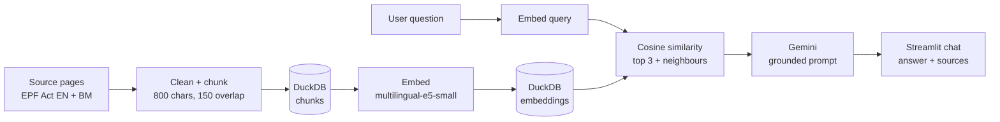

# KWSP / EPF Act Assistant

A bilingual (English / Bahasa Melayu) question-answering chatbot over Malaysia's Employees Provident Fund Act 1991. Built as a data engineering portfolio project: the focus is the pipeline and data quality behind the chatbot, not just the chat window.

**Live demo:** <https://kwspchatbotrag-eqdlhjj4gfnpuukydfgesu.streamlit.app/>
The app sleeps when idle, so the first load can take a minute.


## What it does

- Answers questions in English or BM using only text retrieved from the Act
- Shows the source passages behind every answer
- Says it could not find an answer when the documents don't contain one (for example, dividend rates, which are not loaded)

## How it works



| File | Role |
|---|---|
| `scripts/03_chunk.py` | Cleans text (page headers, footers, menu text), splits into overlapping chunks, loads them into DuckDB |
| `scripts/04_embed.py` | Embeds each chunk with `multilingual-e5-small` and stores 384-dimension vectors in DuckDB |
| `scripts/09_answer.py` | Terminal version of retrieval plus answer generation |
| `app.py` | Streamlit chat app |

Current corpus: the English and BM versions of the EPF Act 1991, <N> chunks in total.

## Data quality: what went wrong and what I changed

1. **Scripted downloads were blocked (HTTP 403)**, so I collected the pages manually instead of working around the block.
2. **The scanned PDFs needed OCR.** The OCR'd English PDF silently missed text hidden under the website's sticky header. I found this by comparing an answer against the live page, saw that it omitted members of a panel, and replaced the PDF with text copied from the page source.
3. **OCR flattened the dividend tables and dropped decimal points.** I excluded them rather than risk a chatbot quoting wrong rates.
4. **Page footers were misread by OCR** (for example "1 of 52" became "Tof52"). I wrote cleaning rules and verified them with SQL queries that search for leftovers.
5. **Chunks split lists across boundaries.** Retrieval now returns each match together with its neighbouring chunks.

## Design decisions

- **Grounded prompt:** answer only from the sources, cite them, and say so when the answer isn't there.
- **No similarity cut-off:** scores for an unanswerable question were as high as for answerable ones, so a threshold would not have worked. The prompt rule handles it.
- **Model fallback:** the app tries a list of Gemini models in order, so a temporary overload (HTTP 503) on one model doesn't break the demo.
- **Local embeddings:** questions and chunks are embedded locally, which keeps cost at zero.

## Known limitations

- No conversation memory: each question is answered on its own.
- No automated evaluation yet. Quality so far is checked by hand against the source text.
- Chunks are cut by character count, so some start or end mid-sentence.
- Only two documents, copied from the KWSP website. BM retrieval quality has not been measured.
- Answers are generated by an LLM and are not legal advice.

## Roadmap

- [ ] Evaluation set (English, BM, Manglish questions) with retrieval hit-rate
- [ ] Chunk by legal section and cite section numbers
- [ ] Raw documents in S3, with the app loading data from there
- [ ] Orchestrate the pipeline with Airflow
- [ ] Tesseract OCR for scanned documents, plus more documents
- [ ] Conversation memory for follow-up questions
- [ ] Dividend rates as a structured table alongside the documents

## Run locally (Windows PowerShell)

```
git clone https://github.com/noramaninaabiden/KWSPChatbotRAG.git
cd KWSP_RAG
python -m venv .venv
.venv\Scripts\Activate.ps1
pip install -r requirements.txt
```

Create a `.env` file containing `GEMINI_API_KEY=your-key`, then:

```
streamlit run app.py
```

To rebuild the database from the text files in `data/raw`:

```
python scripts\03_chunk.py
python scripts\04_embed.py
```

## Source and disclaimer

Content comes from the public EPF (KWSP) website. This is an independent portfolio project, not affiliated with or endorsed by KWSP, and not official or legal advice.